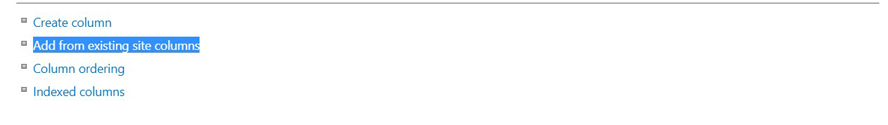
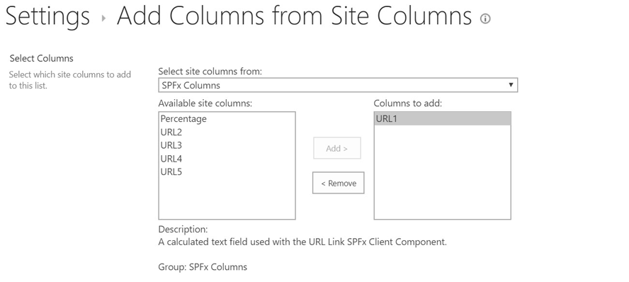
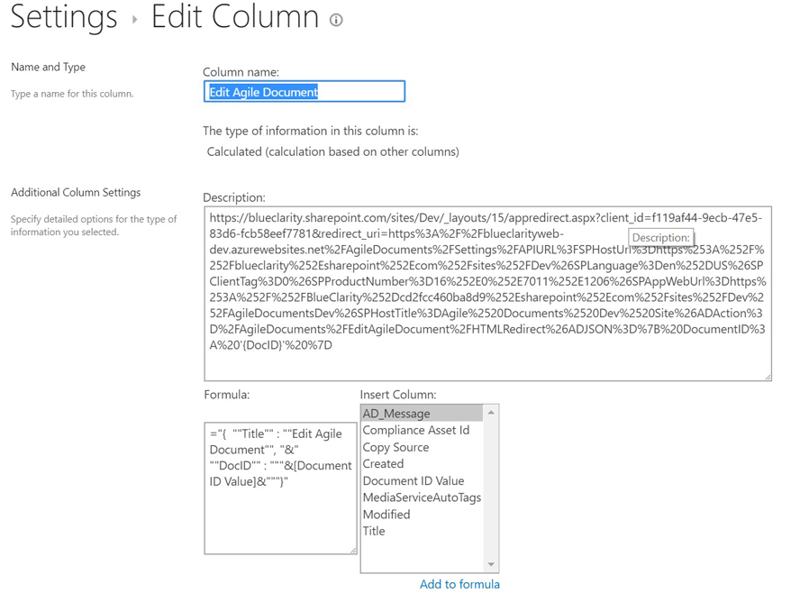
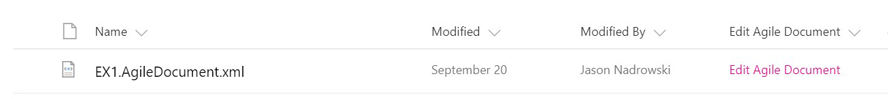

# URL Link in a SharePoint Calculated Field - SharePoint Framework Field Customizer

## Summary
This is a SharePoint Field Customizer for showing a clickable link in a column. 

For a long time, SharePoint allowed HTML markup in a calculated column. The could allow for the user to click on some custom link. This functionality was eliminated in [June 2017](https://support.microsoft.com/en-gb/help/4032106/handling-html-markup-in-sharepoint-calculated-fields). 

However, a lot of people still desire and need to use this functionality--including myself. To provide **similar** functionality, this Field Customizer was created. 

This customizer takes a URL "template"--which is defined in the column description--and then injects data from JSON defined in the column value. The result is a clickable link rendered for the column. 

Column Description: 
```
http://www.blueclarity.com/testme?param1={Param1}
```

Column Value: 
```
{  "Title" : "ClickMe", "Param1" : "SomeValue" }
```

Yields Column Rendering: 
```
<a href="http://www.blueclarity.com/testme?param1=SomeValue" target="_blank">ClickMe</a>
```

## Minimal Path to Usage
On the theory there are some people who want to use this without wanting to customize it, I have installed this on my SharePoint CDN and build an app package pointing to that CDN. All you need to do is add distribution\js-field-url-link.sppkg to your SharePoint Online App Catalog. Next add that app to whatever site you desire. Then follow the steps detailed in the Example Use section below.

**NOTE:** When using the pre-built app package, the library will only render correctly if the list uses the new design experience and NOT the the classic experience.

## Example Use

Once, the app has been added to your SharePoint App Catalog and then has been added to your site, edit the appropriate list/doc-lib settings. In the list/doc-lib settings, "Add from existing site columns" (below). 


Then, select one of the five URL columns. I selected URL1 in the figure below.


As shown below, specify your template URL for the column Description and the appropriate JSON as the Column Formula. Feel free to rename the column name.


The rendered column will look like the following.


## More Details

Please note the following:
* Title is used to define the inner text of the A element.
* Title can also be used as a parameter.
* If Title is undefined OR an empty string, the URL link will NOT be output.
* Parameters are referenced as {param} in the URL template in the column description.


## Used SharePoint Framework Version


## Applies to

* [SharePoint Framework Extensions](https://dev.office.com/sharepoint/docs/spfx/extensions/overview-extensions)
* [PnP JavaScript Core](https://github.com/SharePoint/PnP-JS-Core)

## Solution

Solution|Author(s)
--------|---------
js-field-url-link|Jason Nadrowski ([Blue Clarity](https://www.blueclarity.com), @JasonNadrowski)

## Version history

Version|Date|Comments
-------|----|--------
1.0.0|Oct 30, 2017|Initial release
1.0.1|Nov 01, 2017|Updated with CDN information


## Debug URL for testing
Here's a debug querystring for testing this sample.

```
?loadSPFX=true&debugManifestsFile=https://localhost:4321/temp/manifests.js&fieldCustomizers={"URL1":{"id":"52873a09-61fd-401e-a122-69ed104d5429","properties":{"target":"_blank"}}}
```

Your URL will look similar to the following (replace with your domain and site address):
```
https://yourtenant.sharepoint.com/sites/yoursite/Lists/yourlist/AllItems.aspx?loadSPFX=true&debugManifestsFile=https://localhost:4321/temp/manifests.js&fieldCustomizers={"URL1":{"id":"52873a09-61fd-401e-a122-69ed104d5429","properties":{"target":"_blank"}}}
```

**NOTE:**
* Relace URL1 in the string ABOVE to reflect your column's name while debugging.
* After debugging, update sharepoint/assets/elements.xml to define the column(s) this field customizer applies to. See notes in that file for more insights.

## Prerequisites

* Office 365 Developer tenant with a  site collection and a list.

## Additional Insights

See [Build your first Field Customizer Extension](https://docs.microsoft.com/en-us/sharepoint/dev/spfx/extensions/get-started/building-simple-field-customizer) for additional insight.


